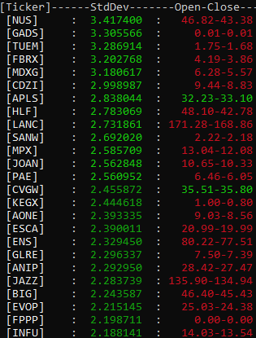
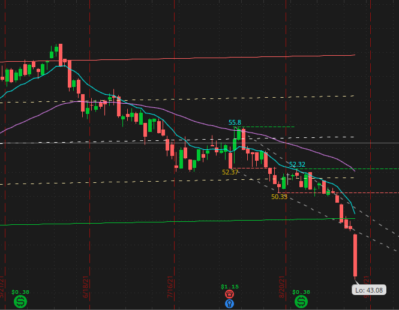

# Market Std Deviation Calculator
___ 
Market Std Deviation Calculator was a project created to calculate the Standard Deviation of a list of Tickers in the stock market. 
From that data, would sort and list an N amount of tickers with the best deviations from the normal line. This project was created 
mostly for fun as well as attempting to learn how to use TDAmeritrades API for possible future plans with it. 

The project uses [libcurl](https://curl.se/libcurl/c/) to handle all the API calls in c++. So you will need to install cURL in the
same directory of MarketStdDeviationCalculator and build it for your desired setup. Along with getting an API key from 
[TDAmeritrade](https://developer.tdameritrade.com/content/getting-started) to get stock information. 

---
Goal(s)
---
Scan the market(Over 5000+ tickers) and find the ones deviating the most from their normal line.

___
##Functionality
___
The project consists of one main function, which is generating a list of the top stocks below their normal(average) line. Aided by 
two other functions that generate the information from the API, as well as a function for fixing any broken/missing files. TDAmeritrade
only allows the API to be accessed at 60 Tickers/min on a free use key. So generating 5000+ tickers takes time for obvious reasons. In
case this process has been interrupted, the project also allows the Tickers to be rebuilt if their file is empty or doesn't exist.

 
Above you can see the output of a list of Tickers that are below their normal line by x StdDevs.

 
This image shows the Ticker [NUS] which as you can see from yellow dotted lines(1st Dev) and green solid line(2nd Dev), NUS is in
fact around 3.4 StdDevs away from the normal line(White dotted line). 

___
##Future Ideas
___
I might come back to this project to do more numerical calculations on the data. RSI and maybe various values are things I would
like to include as output. Or of course when I get more experience with the market.

___
##Note
___
THIS IS NOT FINANCIAL ADVICE. THIS PROJECT WAS FOR FUN AND TO LEARN A LITTLE SOMETHING.

Also, I found out that thinkorswim from TDAmeritrade has their own scanner after I started this project already. But I couldn't 
just not finish the project!

